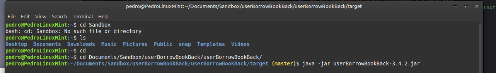

Firstly, double check that Maven is installed in your machine. If not run the following command:
```
sudo apt install maven
```
To create a jar file to work outside the IDE platform, we have to run the command:
```
mvn clean install
```

This jar should be executed before running the Front side of the app. By this way, you do not need to keep IntelliJ opened during working with the front side. The code to execute the jar files is as follow, assuming that the jar file name is **userBorrowBookBack-3.4.2.jar**

```Linux
java -jar userBorrowBookBack-3.4.2.jar

```


