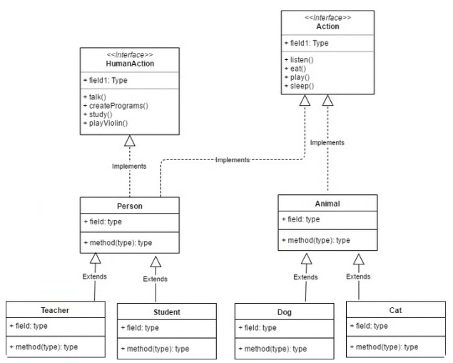

Abstraction and particularly `Interfaces` provide a **way for multiple classes to share a common set of methods or properties, without inheriting from a common base class.**

`Interfaces` are the tool when the code needs **order**, **be clear** and **be easly readable**.

---

> This allows for greater **flexibility** in designing and implementing classes, as well as allowing for **multiple inheritance**.

> `Interfaces` also promote **code reuse and can be used to define contracts for classes to implement,** which can help ensure that certain methods or properties are present in a class.

> Additionally, Java’s support for `default` [methods](https://docs.oracle.com/javase/tutorial/java/IandI/defaultmethods.html) in interfaces allows for the addition of new methods to an interface **without breaking existing code that implements the interface.**

## 1 Abstract/Interface

**Data abstraction** is the process of **hiding certain details and showing only essential information to the user.**

**Abstraction** can be achieved with either:

- abstract classes or
- interfaces




From regular class to Interface passing by Abstract class

An interface is a completely “abstract class” that is used to group related methods with empty bodies

### 1.1 Abstract class

The `abstract` keyword is a **non-access modifier**, used for classes and methods:

- **Abstract class**: is a restricted class that **cannot be used to create objects** (to access it, it must be inherited from another class).
- **Abstract method**: can only be used in an abstract class, and *it does not have a body*. The body is provided by the subclass (inherited from).

```java
moviemodel.java
```

```java
// Abstract class
abstract class Animal {
  // Abstract method (does not have a body)
  public abstract void animalSound();
  // Regular method
  public void sleep() {
    System.out.println("Zzz");
  }
}

// Subclass (inherit from Animal)
class Pig extends Animal {
  public void animalSound() {
    // The body of animalSound() is provided here
    System.out.println("The pig says: wee wee");
  }
}
```

### 1.2 Interface

To access the interface methods, the interface must be “implemented” (kinda like inherited) by another class with the `implements` keyword (instead of extends). The body of the interface method is provided by the “implement” class:

```java
moviemodel.java
```

```java
// Interface
interface Animal {
  public void animalSound(); // interface method (does not have a body)
  public void sleep(); // interface method (does not have a body)
}

// Pig "implements" the Animal interface
class Pig implements Animal {
  public void animalSound() {
    // The body of animalSound() is provided here
    System.out.println("The pig says: wee wee");
  }
  public void sleep() {
    // The body of sleep() is provided here
    System.out.println("Zzz");
  }
}
```

Note

- Like abstract classes, interfaces **cannot be used to create objects**
- Interface methods **do not have a body** - the body is provided by the “implement” class
- On implementation of an interface, you\*\* must override all of its methods\*\*
- Interface methods are **by default abstract and public**
- Interface attributes are **by default public, static and final**
- An interface **cannot contain a constructor** (as it cannot be used to create objects)

## 2 Pros & cons of interfaces

### 2.1 Pros of using interfaces:

- Interfaces provide a way to define a contract that classes must implement, ensuring that certain methods or properties are present. Interfaces allow for multiple inheritance, allowing a class to implement multiple interfaces.
- Interfaces promote code reuse by allowing multiple classes to share a common set of methods or properties.
- Java’s support for default methods in interfaces allows for the addition of new methods to an interface without breaking existing code that implements the interface.
- Interfaces can be used to define a common API for different implementations of a specific functionality.

### 2.2 Cons of using interfaces:

- An interface does not provide any implementation for its methods or properties, so classes that implement an interface must provide their own implementation.
- Interfaces can lead to more complex code, as it may require more effort to understand how the different classes and interfaces relate to each other.
- Interfaces can make it more difficult to understand the relationships between classes, as it may not be immediately clear which classes implement a specific interface.
- Interfaces can lead to a proliferation of small, highly-specialized interfaces, which may make the codebase harder to understand and maintain.
Important

Java does not support “multiple inheritance” (a class can only inherit from one superclass). However, it can be achieved with interfaces, because the class can implement multiple interfaces.

📘 **Linux Lab#SE00-4: Abstract/Interface Human**

1. Implement this UML and its classes.
2. Create a @Test and a method for each class:
	- `Person`
	- `Animal`
	- `Teacher`
	- `Student`
	- `Dog`
	- `Cat`

---

## 1 Basic UML

The interfaces `HumanAction` and `Action` define a **set of methods or properties that classes must implement.**

The class `Person` implements both interfaces and provides implementation for the methods defined in both `HumanAction` and `Action`.

`Animal` class implements `Action` interface and provides its own implementation for the methods defined in the interface.


UML to code

Here is an example of a UML diagram that shows the relationship between the interfaces `HumanAction` and `Action` and the classes `Person`, `Teacher`, `Student`, `Animal`, `Dog` and `Cat`.

This **UML diagram illustrates that the classes Person, Teacher, Student, Animals, Dog, Cat all implement the methods defined** in `HumanAction` and `Action`

It also show the **Inheritance** relationship between classes and implementation relationship between classes and `interfaces`.

`Teacher` and `Student` classes **inherit** from `Person` class and add their own specific behavior/ methods.

`Dog` and `Cat` classes **inherit** from `Animal` class and add their own specific behavior/ methods.