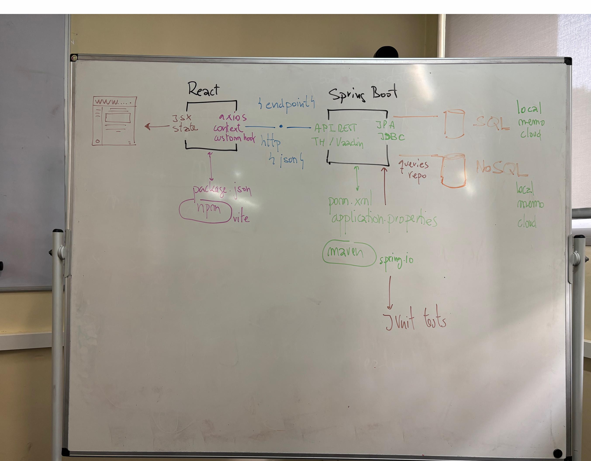
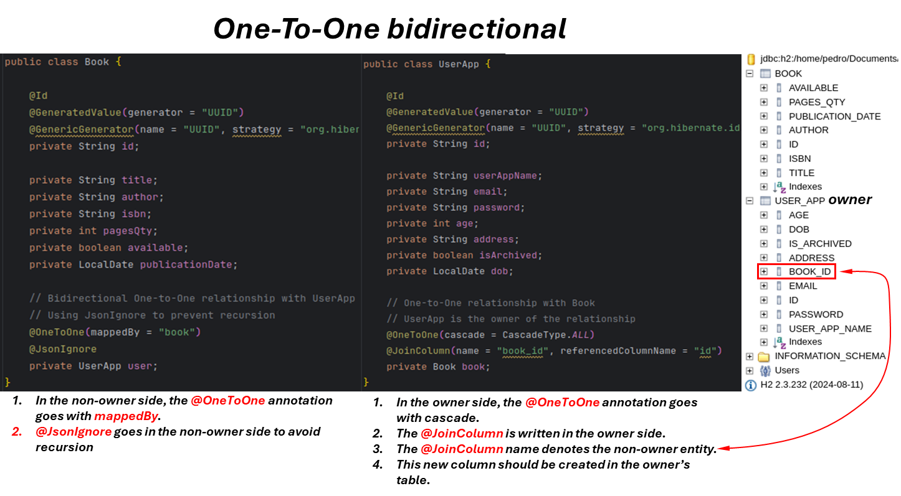
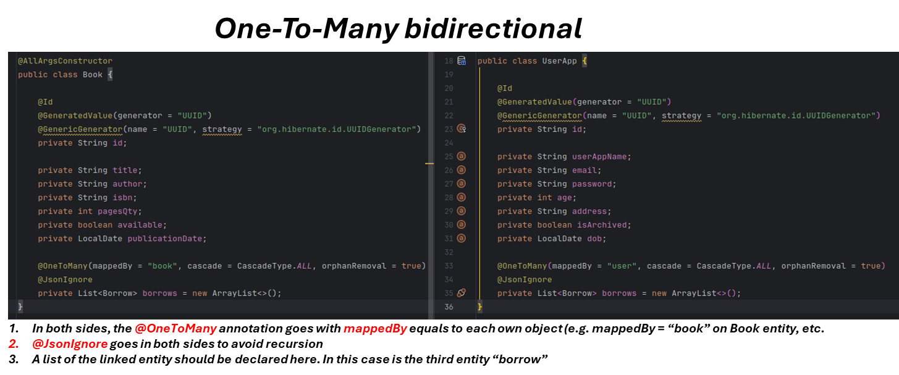
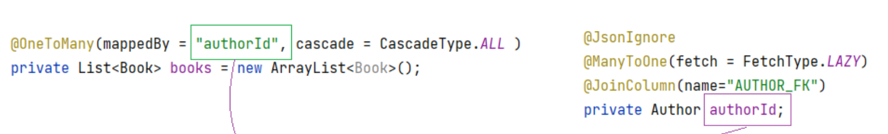
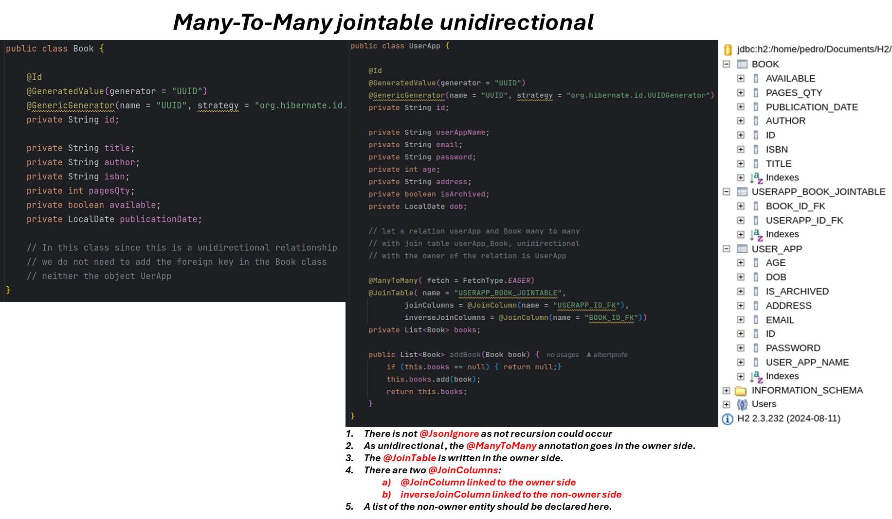
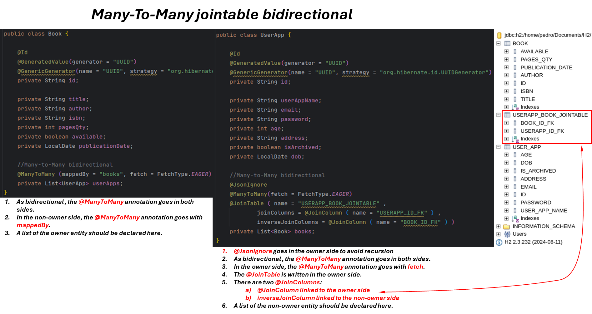
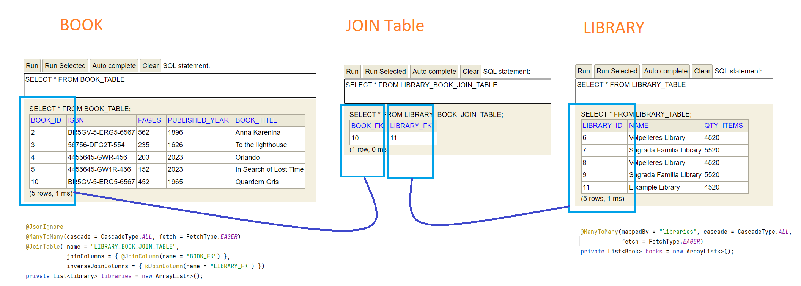
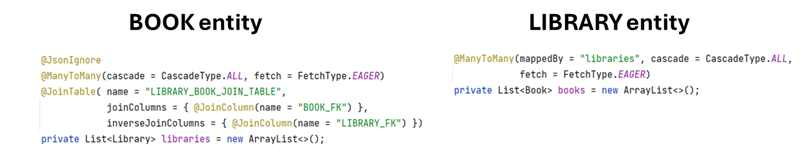
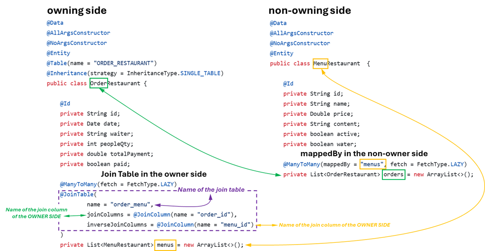
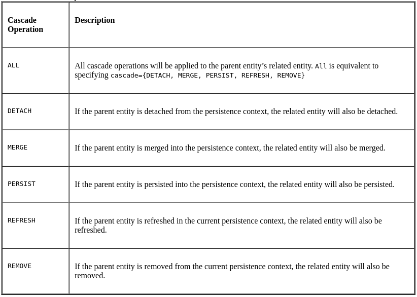

The Java Persistence API provides Java developers with an object/relational mapping facility for managing relational data in Java applications.

Go to here for official docs:
[Official docs for Spring Boot JPA queries](https://docs.spring.io/spring-data/jpa/reference/jpa.html)

## Bidirectional Relationships
 [Official Oracle docs](https://docs.oracle.com/cd/E19798-01/821-1841/bnbqi/index.html)
 
In a bidirectional relationship, both entities have references to each other, so that each entity has a relationship field or property that refers to the other entity. Through the relationship field or property, an entity class’s code can access its related object. If an entity has a related field, the entity is said to “know” about its related object.. Bidirectional relationships must follow these rules:

1. The inverse side of a bidirectional relationship must refer to its owning side by using the mappedBy element of the @OneToOne, @OneToMany, or @ManyToMany annotation. The mappedBy element designates the property or field in the entity that is the owner of the relationship.
2. The many side of many-to-one bidirectional relationships must not define the **mappedBy** element. The many side is always the owner of this relationship, so it is owning side of the relationship.
3. For one-to-one bidirectional relationships, the owning side corresponds to the side that contains the corresponding foreign key.
4. For many-to-many bidirectional relationships, either side may be the owning side.
## Unidirectional Relationships
In a unidirectional relationship, only one entity has a relationship field or property that refers to the other. For example, LineItem would have a relationship field that identifies Product, but Product would not have a relationship field or property for LineItem. In other words, LineItem knows about Product, but Product doesn’t know which LineItem instances refer to it.
## Multiplicity in Entity Relationships
[Albert JPA info](https://albertprofe.dev/springboot/boot-concepts-jpa-3.html)

Multiplicities are of the following types: one-to-one, one-to-many, many-to-one, and many-to-many:

- **One-to-one**: Each entity instance is related to a single instance of another entity. For example, to model a physical warehouse in which each storage bin contains a single widget, StorageBin and Widget would have a one-to-one relationship. One-to-one relationships use the javax.persistence. OneToOne annotation on the corresponding persistent property or field.
- **One-to-Many**: An entity instance can be related to multiple instances of the other entity. An author, for example, can have multiple books, whereas a book only have one author.  Then, the JPA relationship from author's table to book's table is an **One-To-Many** with the annotation on the corresponding persistent property or field. Then, the One entity (author) has a collection of another entity (Books) and only <u>the owning side (the One side)</u> has a reference to the other entity.
- **Many-to-One**: On the other hand, the JPA relationship from Book table to Author table is a **Many-to-One** because multiple instances (or records, e.g. books) of an entity can be related to a single instance of the other entity (only one author has written a book). Many entities are associated with one entity and only <u>the owing side (the Many side)</u> has a reference to the other entity.In the image above, the **mappedBy** is written in the @OneToMany left side (Author as only **One** author to **Many** books) specifies the field that **owns** the relationship in the child entity . In this case, Author entity owns the relationship and has a collection of the another entity (List<Book> books). In the **Many** side, the relationship should be **@ManyToOne** (in other words, Book's table To Author's table) and is here where to insert the **@JoinColumn**.  
 
- **Many-to-many**: The Many to Many relationship could be unidirectional and bidirectional. In the bidirectional, the multiple instances of one entity can be related to multiple instances of another one. For example, each course has many students, and every student may take several courses. Therefore, in an enrolment application, Course and Student would have a many-to-many relationship. The ManyToMany annotation is done on the corresponding persistent property or field. In bidirectional ManyToMany relationships, use mappedBy on the non-owning side to indicate the owning side’s field name. The @JoinTable annotation is used to specify the join table details.

## Fetch Types
[https://thorben-janssen.com/entity-mappings-introduction-jpa-fetchtypes/]()

This is one of the most important decisions when defining your entity mapping. You can choose between EAGER and LAZY loading. The first one fetches an association immediately, and the other only when you use it. I explain both options in this article.

This default depends on the cardinality of the association. All to-one associations use FetchType.EAGER and all to-many associations FetchType.LAZY.

FetchType.EAGER tells Hibernate to get the associated entities with the initial query. This can look very efficient because it fetches all entities with only one query. But in most cases, it creates a huge overhead because Hibernate fetches these entities even if your business code doesn’t use them.

You can prevent this with FetchType.LAZY. It tells Hibernate to delay the initialisation of the association until you access it in your business code.

> [!warning] 
> Eager loading fetches all related data immediately, making everything available upfront. It can be faster for frequent access but may use more memory. 

Lazy loading, on the other hand, loads related data only when requested, initializing it on-demand. This approach saves memory but might cause slight delays on first access.
##### Key Points
- For @OneToMany and @ManyToMany, the default fetch type is LAZY.
- For @ManyToOne and @OneToOne, the default fetch type is EAGER.
- Using FetchType.LAZY is generally recommended to avoid performance issues, especially for collections.
- The cascade attribute determines which operations should be cascaded from parent to child entities.
- The orphanRemoval attribute is useful for automatically removing child entities when they are no longer referenced by the parent.

##### Cascade Operations and Relationships
Entities that use relationships often have dependencies on the existence of the other entity in the relationship. For example, a line item is part of an order; if the order is deleted, the line item also should be deleted. This is called a cascade delete relationship.

