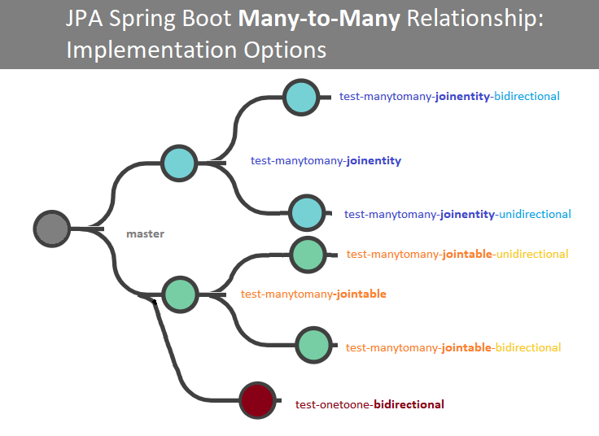

## Introduction

In JPA (Java Persistence API) with Spring Boot, many-to-many relationships between entities can be implemented in **two main ways**:

1. **Using `@ManyToMany` with `@JoinTable`:**
   - This approach can be configured as either **unidirectional** or **bidirectional**.
   - It relies on a **join table** managed by JPA through the `@JoinTable` annotation.
   - Example:
     ```java
     @ManyToMany
     @JoinTable(
         name = "student_course",
         joinColumns = @JoinColumn(name = "student_id"),
         inverseJoinColumns = @JoinColumn(name = "course_id")
     )
     private Set<Course> courses;
     ```
   - **Use case:** Ideal for simple relationships where the join table does not require additional attributes.

2. **Using an Intermediate Entity with `@OneToMany` and `@ManyToOne`:**
   - This approach involves creating an **intermediate entity** to represent the relationship explicitly.
   - The intermediate entity acts as an **assignment table** and connects the two main entities using `@OneToMany` and `@ManyToOne`.
   - Example:
     ```java
     @Entity
     public class StudentCourse {
         @Id
         @GeneratedValue(strategy = GenerationType.IDENTITY)
         private Long id;

         @ManyToOne
         @JoinColumn(name = "student_id")
         private Student student;

         @ManyToOne
         @JoinColumn(name = "course_id")
         private Course course;

         // Additional attributes (e.g., enrollment date, grade)
         private LocalDate enrolledDate;
     }
     ```
   - **Use case:** Necessary when the relationship requires additional attributes or when more control over the join table is needed.

## Branches diagram

This diagram explores both approaches, highlighting their differences, use cases, and configurations, such as:
- **Ownership** (owning side vs. inverse side)
- **Unidirectional vs. bidirectional mappings**
- **Choice between a join table or an explicit entity table**


