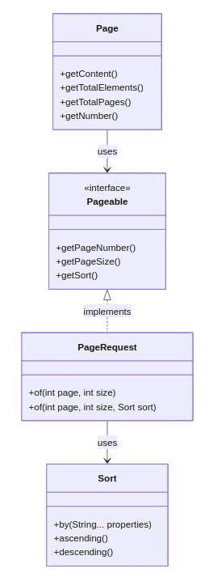

## Pagination
### Projects about JPA pagination
- userBorrowBook back (offical backend para react)
- userBorrowBookPagination (example to show how paginate)
- BooksPageable (example for pagination with timelift)
- userBorrowBookFilter (example to explain how filters works)
## Links & Intro

- [AlbertProfe's list / userBorrowBook · GitHub](https://github.com/stars/AlbertProfe/lists/userborrowbook)
- [GitHub - AlbertProfe/BooksPageable](https://github.com/AlbertProfe/BooksPageable)
- [https://spring.io/projects](https://spring.io/projects)
- [Baeldung Spring Data JPA](https://www.baeldung.com/spring-data-jpa-pagination-sorting)
- [Offical docs](https://docs.spring.io/spring-data/rest/reference/paging-and-sorting.html)
- [Methods](https://docs.spring.io/spring-data/commons/docs/current/api/org/springframework/data/domain/Pageable.html)
- [Defining Query Methods Spring Data JPA](https://docs.spring.io/spring-data/jpa/reference/repositories/query-methods-details.html#repositories.special-parameters)

Five points to bear in mind:

1. Pagination is temporal, not persistent.
2. Page size (number of items per page)
3. Number of pages
4. The page you are at that moment
5. Which is the next page

Example of pagination:

The `Pageable` interface in Spring Data JPA is used to provide pagination and sorting functionality for database queries.
## About handling large results

`Spring Data` provides powerful features for handling large result sets through `paging`, `sorting`, and `limiting`.

The infrastructure recognises specific types like `Pageable`, `Sort`, and `Limit` to <font color="#00b050">dynamically apply these operations</font> to queries. Pagination can be implemented using the Page or Slice return types:

- **Page** provides information about the total number of elements and pages, but requires an additional count query.
- **Slice** is more efficient as it only indicates if there's a next page available.

**Sorting**
`Sorting` can be applied using the `Sort` parameter or through the `Pageable` instance. Limiting results can be achieved using the `Limit` parameter or by using the First or Top keywords in method names.

**Query structure: List or Stream?**
When choosing a method to consume large query results, developers should consider the amount of data fetched and query structure:

- ==**List and Streamable** fetch all results in a single query but risk memory exhaustion.==
- ==**Stream and Flux** fetch data in chunks, which is more memory-efficient but requires proper resource management.==

**Repositories**
To implement `pagination`, repositories should extend `PagingAndSortingRepository`. `PageRequest` objects can be created with page number, size, and sorting criteria. For sorting, developers can specify sort direction and fields.

> When dealing with large datasets, choosing the appropriate method (Page, Slice, Stream, or Flux) depends on the specific requirements of the application and the nature of the data being queried.
## Key concepts

Page, Pageable, and PageRequest in Spring Data JPA:

| Concept     | Description                   | Key Features                                                                                                                               |
| ----------- | ----------------------------- | ------------------------------------------------------------------------------------------------------------------------------------------ |
| Page        | Container for paginated data  | \- Holds subset of data   \- Contains actual content (list of items)   \- Provides metadata (total elements, total pages, current page)    |
| Pageable    | Interface for pagination info | \- Defines pagination parameters   \- Specifies page number and size   \- Includes sorting criteria   \- Used in repository methods        |
| PageRequest | Implementation of Pageable    | \- Creates Pageable objects   \- Specifies page number, size, and sorting   \- Example: PageRequest.of(0, 10, Sort.by("name").ascending()) |

## How it works

- [data.sql at master userBorrowBookPagination · GitHub](https://github.com/AlbertProfe/userBorrowBookPagination/blob/master/userBorrowBookPagination/src/main/resources/data.sql)

> For example, with our books sets of data (20 `books` ). Let's explore what happen when we call `findPaginated(0, 5)`

The pagination system in Spring Data JPA doesn't hold the entire result set in memory. Instead, it uses database-level pagination to fetch only the requested page of results. Here's how it works:

1. When we call `findPaginated(0, 5)`, Spring Data JPA translates this into a database query tha t **fetches only the first 5 records.**
2. ==The database executes this query and returns **only the requested page of results.**==
3. ==Spring Data JPA wraps these results in a `Page` object, which contains:==
	- The **requested page of data (5 books in this case)**
	- **Metadata** about the pagination (total number of pages, total number of elements, etc.)
4. ==The `Page` object is then returned to our application.==
5. ==Subsequent calls for different pages (e.g., `findPaginated(1, 5)` for the second page) will trigger new database queries to fetch the specific page requested.==

> ==Spring Data JPA's pagination system **can handle datasets with over 1 billion rows,** ensuring efficient data navigation without overwhelming system [memory](https://www.linkedin.com/pulse/mastering-spring-data-jpa-pagination-sorting-custom-queries-lolage-fya0f).==
> 
> ==The application itself only holds the **current page of results in memory**, not the entire dataset or all pages.==

## Response Structure

==When using Spring Data JPA's `Pageable` interface and returning a `Page` object, the ==JSON structure of the response== will include both:==

- the ==paginated== content (list of `Book` entities)
- and ==metadata== about pagination.

==Below is an example of the JSON structure you can expect from the `bookPageable` endpoint.==

### JSON Structure of bookPageable Response

==Example Response for `/api/v1/books?page=0&size=5`==

If you query the endpoint with pagination parameters ( `page=0&size=5` ) and there are books in your database, you will get a response similar to the below JSON structure.

```
{
  "content": [
    {
      "id": 1,
      "title": "Book Title 1",
      "author": "Author Name 1",
      "publishedDate": "2023-01-01",
      "isbn": "1234567890"
    },
    {
      "id": 2,
      "title": "Book Title 2",
      "author": "Author Name 2",
      "publishedDate": "2023-02-01",
      "isbn": "0987654321"
    }
    // Additional book objects based on page size
  ],
  "pageable": {
    "sort": {
      "sorted": false,
      "unsorted": true,
      "empty": true
    },
    "offset": 0,
    "pageNumber": 0,
    "pageSize": 5,
    "paged": true,
    "unpaged": false
  },
  "totalPages": 10,
  "totalElements": 50,
  "last": false,
  "size": 5,
  "number": 0,
  "sort": {
    "sorted": false,
    "unsorted": true,
    "empty": true
  },
  "first": true,
  "numberOfElements": 5,
  "empty": false
}
```

Explanation of the Fields:

1. **`content`**: Contains the list of `Book` objects for the current page. Each object represents a single book with its fields (e.g., `id`, `title`, `author`, etc.).
2. **`pageable`**: Provides details about the pagination request:
	- `sort`: Indicates sorting details (e.g., whether sorting is applied).
	- `offset`: The starting index for the current page.
	- `pageNumber`: The current page number.
	- `pageSize`: The number of items per page.
	- `paged`: Whether pagination is enabled.
	- `unpaged`: Whether pagination is disabled.
3. **`totalPages`**: Total number of pages available.
4. **`totalElements`**: Total number of elements (books) in the database.
5. **`last`**: Indicates whether the current page is the last page.
6. **`size`**: Number of elements per page (same as page size).
7. **`number`**: Current page number (starting from zero).
8. **`sort`**: Sorting metadata (same as in pageable).
9. **`first`**: Indicates whether the current page is the first page.
10. **`numberOfElements`**: Number of elements on the current page.
11. **`empty`**: Indicates whether the current page has no elements.

Customizing JSON Output:

If you want to customize this JSON structure (e.g., exclude metadata or include additional fields), you can:

- Use DTOs to map only specific fields.
- Implement custom serialization with libraries like Jackson.
## Code

```
@Repository
public interface BookRepository extends PagingAndSortingRepository<Book, String> {}

@Service
public class BookService {

@Autowired
private BookRepository bookRepository;

public Page<Book> findPaginated(int pageNo, int pageSize) {

    Pageable pageable = PageRequest.of(pageNo , pageSize);

return bookRepository.findAll(pageable);
}
```

> This service provides a simple way to retrieve books in a paginated manner, which is useful for displaying large sets of data in smaller chunks, like in a web interface with multiple pages of results.

Explanation:

1. `@Service`: This annotation marks the class as a service component in Spring's component scanning.
2. `@Autowired private BookRepository bookRepository`: This injects the BookRepository into the service, allowing us to use its methods.
3. `public Page<Book> findPaginated(int pageNo, int pageSize)`: This method provides paginated access to the books.
4. `Pageable pageable = PageRequest.of(pageNo, pageSize)`: This creates a Pageable object, which encapsulates pagination information (page number and page size).
5. `return bookRepository.findAll(pageable)`: This calls the findAll method on the repository, passing the Pageable object. It returns a Page containing the requested subset of books.