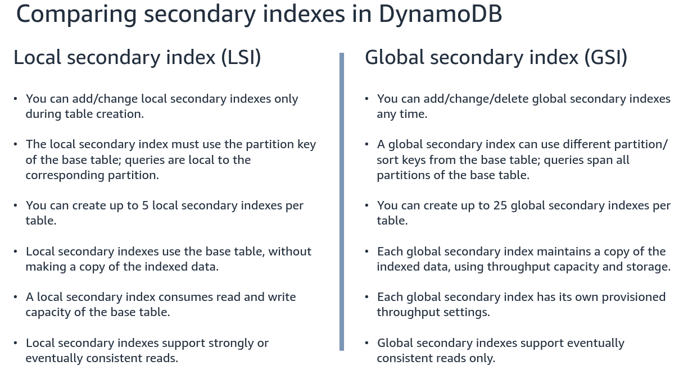

[AWS DynamoDB](AWS%20DynamoDB.md)
[AWS official command list](https://awscli.amazonaws.com/v2/documentation/api/latest/reference/dynamodb/index.html)
You can install the AWS CLI by using one of the following methods:

- **The command line installer** is good option for version control, as you can specify the version to install. This option does not auto-update and you must download a new installer each time you update to overwrite previous version.
- **The officially supported `snap` package** is a good option to always have the latest version of the AWS CLI as snap packages automatically refresh. There is no built-in support for selecting minor versions of AWS CLI and therefore is not an optimal install method if your team needs to pin versions.

#### Install or update the AWS CLI

> [!Warning]
> If this is your first time updating on Amazon Linux, to install the latest version of the AWS CLI, you must uninstall the pre-installed yum version using the following command:
> 
> 
> $ sudo yum remove awscli
> 

After the `yum` installation of the AWS CLI is removed, follow the below Linux install instructions.

It is provided an official AWS supported version of the AWS CLI on `snap`. If you want to always have the latest version of the AWS CLI installed on your system, a snap package provides this for you as it auto-updates. If your Linux platform does not already have `snap` installed, install `snap` on your platform.

To verify that `snap` is installed correctly, run the following command.
```
snap version
```

Run the following `snap install` command for the AWS CLI.

```
$ snap install aws-cli --classic
```

Depending on your permissions, you may need to add `sudo` to the command.

```
$ sudo snap install aws-cli --classic
```

Verify that the AWS CLI installed correctly.

```
$ aws --version
```

Finally, run this command:
```
$ aws configure
```

to configure your aws keys.
### Comparing secondary indexes in DynamoDB


## AWS CLI

The AWS Command Line Interface (CLI) allows you to manage DynamoDB resources from the terminal.

- **Installation**:
    
    - Install AWS CLI: [AWS CLI Installation Guide](https://docs.aws.amazon.com/cli/latest/userguide/install-cliv2.html).
    - Configure credentials: `aws configure`.
- **Common Commands**:
    
    - Create a table:
        
        ```bash
        aws dynamodb create-table \
            --table-name MyTable \
            --attribute-definitions \
            AttributeName=ID,AttributeType=N \
            AttributeName=Name,AttributeType=S \
            --key-schema 
            AttributeName=ID,KeyType=HASH \
            AttributeName=Name,KeyType=RANGE \
            --provisioned-throughput ReadCapacityUnits=5,WriteCapacityUnits=5
        ```
        
    - To create or execute to Put an item, it is needed to specify the table name and the primary key, which includes a hash (partition) and an optional range (sort) key as follows:
        
        ```bash
        aws dynamodb put-item \
            --table-name MyTable \
            --item \
            '{"ID": {"S": "123"},
              "Name": {"S": "John Doe"}}'
        ```
        
    - Query a table:
        
        ```bash
        aws dynamodb query \
            --table-name MyTable \
            --key-condition-expression "ID = :id" \
            --expression-attribute-values '{":id": {"S": "123"}}'
        ```
    - Scan a table to review the full dataset and retrieve one or more items and item attributes:
        
        ```bash
        aws dynamodb scan \
            --table-name MyTable \
            --filter-expression "ID = :id" \
            --expression-attribute-values '{":id": {"S": "123"}}'\
            --return-consumed-capacity 'TOTAL'
        ```
        
    - Enable TTL:
        
        ```bash
        aws dynamodb update-time-to-live \
            --table-name MyTable \
            --time-to-live-specification "Enabled=true, AttributeName=ExpirationTime"
        ```
        
- **Resources**: [DynamoDB CLI Reference](https://docs.aws.amazon.com/cli/latest/reference/dynamodb/).