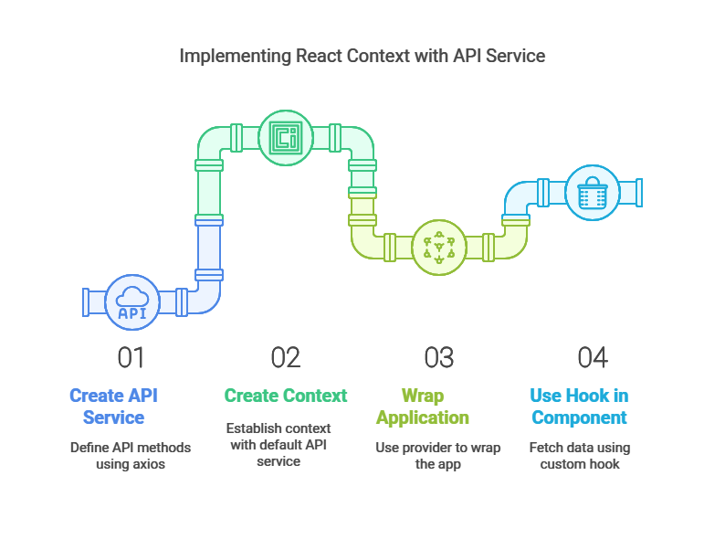

## How to Use Context with an API Service
[REACT Axios Basic Notes](REACT%20Axios%20Basic%20Notes.md)
Here’s how you can implement React Context for an API service:

### Step 1: Create Your API Service

```jsx
import axios from "axios";

const API_BASE_URL = "https://api.example.com";

const ApiService = {
  getAllItems: async () => {
    try {
      const response = await axios.get(`${API_BASE_URL}/items`);
      return response.data;
    } catch (error) {
      console.error("Error fetching items:", error);
      throw error;
    }
  },

  createItem: async (item) => {
    try {
      const response = await axios.post(`${API_BASE_URL}/items`, item);
      return response.data;
    } catch (error) {
      console.error("Error creating item:", error);
      throw error;
    }
  },

  updateItem: async (item) => {
    try {
      const response = await axios.put(`${API_BASE_URL}/items/${item.id}`, item);
      return response.data;
    } catch (error) {
      console.error("Error updating item:", error);
      throw error;
    }
  },

  deleteItem: async (itemId) => {
    try {
      const response = await axios.delete(`${API_BASE_URL}/items/${itemId}`);
      return response.data;
    } catch (error) {
      console.error("Error deleting item:", error);
      throw error;
    }
  },
};

export default ApiService;
```

### Step 2: Create a Context for the Service

```jsx
import React, { createContext, useContext } from "react";
import ApiService from "./ApiService";

// Create a context with ApiService as the default value
const ApiServiceContext = createContext(ApiService);

// Custom hook to use the ApiService
export const useApiService = () => useContext(ApiServiceContext);

// Provider component
export const ApiServiceProvider = ({ children }) => (
  <ApiServiceContext.Provider value={ApiService}>
    {children}
  </ApiServiceContext.Provider>
);
```

## Step 3: Wrap Your Application with the Provider

```jsx
import React from "react";
import { ApiServiceProvider } from "./ApiService";
import ItemList from "./ItemList";

function App() {
  return (
    <ApiServiceProvider>
      <div className="App">
        <h1>Item Management</h1>
        <ItemList />
      </div>
    </ApiServiceProvider>
  );
}

export default App;
```

### Step 4: Use the Hook in Your Components

```jsx
import React, { useEffect, useState } from "react";
import { useApiService } from "./ApiService";

function ItemList() {
  const apiService = useApiService();
  const [items, setItems] = useState([]);

  useEffect(() => {
    async function fetchItems() {
      try {
        const data = await apiService.getAllItems();
        setItems(data);
      } catch (error) {
        console.error("Failed to fetch items:", error);
      }
    }

    fetchItems();
  }, [apiService]);

  return (
    <div>
      <h2>Items</h2>
      <ul>
        {items.map((item) => (
          <li key={item.id}>{item.name}</li>
        ))}
      </ul>
    </div>
  );
}

export default ItemList;
```

## Code `book`

### `BookService`  literal object with all functions

```java
import axios from "axios";

// Base URL for the mock API
const API_BASE_URL = "https://locahost:8080/api/v1";

const BookService = {
  getAllBooks: async () => {
    try {
      const response = await axios.get(`${API_BASE_URL}/books`);
      return response.data;
    } catch (error) {
      console.error("Error retrieving books:", error);
      throw error;
    }
  },

  createBook: async (book) => {
    try {
      const response = await axios.post(`${API_BASE_URL}/books`, book);
      return response.data;
    } catch (error) {
      console.error("Error creating book:", error);
      throw error;
    }
  },

  updateBook: async (book) => {
    try {
      const response = await axios.put(`${API_BASE_URL}/books/${book.id}`, book);
      return response.data;
    } catch (error) {
      console.error("Error updating book:", error);
      throw error;
    }
  },

  deleteBook: async (bookId) => {
    try {
      const response = await axios.delete(`${API_BASE_URL}/books/${bookId}`);
      return response.data;
    } catch (error) {
      console.error("Error deleting book:", error);
      throw error;
    }
  },
};

export default BookService;
```

## `BookService` with Context

```java
import React, { createContext, useContext } from "react";
import axios from "axios";

// Base URL for the mock API
const API_BASE_URL = "https://645.mockapi.io/v1";

const BookService = {
  getAllBooks: async () => {
    try {
      const response = await axios.get(`${API_BASE_URL}/books`);
      return response.data;
    } catch (error) {
      console.error("Error retrieving books:", error);
      throw error;
    }
  },

  createBook: async (book) => {
    try {
      const response = await axios.post(`${API_BASE_URL}/books`, book);
      return response.data;
    } catch (error) {
      console.error("Error creating book:", error);
      throw error;
    }
  },

  updateBook: async (book) => {
    try {
      const response = await axios.put(`${API_BASE_URL}/books/${book.id}`, book);
      return response.data;
    } catch (error) {
      console.error("Error updating book:", error);
      throw error;
    }
  },

  deleteBook: async (bookId) => {
    try {
      const response = await axios.delete(`${API_BASE_URL}/books/${bookId}`);
      return response.data;
    } catch (error) {
      console.error("Error deleting book:", error);
      throw error;
    }
  },
};

// Create a Context for the BookService
const BookServiceContext = createContext(BookService); // Provide the service as the default value

// Custom hook to use the BookService
export const useBookService = () => {
  return useContext(BookServiceContext);
};

// BookServiceProvider component
export const BookServiceProvider = ({ children }) => {
  return (
    <BookServiceContext.Provider value={BookService}>
      {children}
    </BookServiceContext.Provider>
  );
};

export default BookService;
```

### import React from "react"

```jsx
import { BookServiceProvider } from "./BookService";
import BookList from "./BookList";

function App() {
  return (
    <BookServiceProvider>
      <div className="App">
        <h1>My Book App</h1>
        <BookList />
      </div>
    </BookServiceProvider>
  );
}
```

### Use the Custom Hook in a Component

```jsx
import React, { useEffect, useState } from "react";
import { useBookService } from "./BookService";

function BookList() {
  const bookService = useBookService();
  const [books, setBooks] = useState([]);

  useEffect(() => {
    async function fetchBooks() {
      try {
        const data = await bookService.getAllBooks();
        setBooks(data);
      } catch (error) {
        console.error("Failed to fetch books:", error);
      }
    }

    fetchBooks();
  }, [bookService]);

  return (
    <div>
      <h2>Books</h2>
      <ul>
        {books.map((book) => (
          <li key={book.id}>
            {book.title} by {book.author}
          </li>
        ))}
      </ul>
    </div>
  );
}

export default BookList;
```

Summary

- **When to Use Import/Export:** For small projects or when simplicity is key, importing/exporting your API service is often sufficient.

- **When to Use Context:** For larger applications where centralized access, dynamic configuration, or flexibility in swapping implementations is needed, React Context is often the best choice.

- **Best Practices:** Use custom hooks (`useApiService`) for consuming context values and wrap your app with a provider (`ApiServiceProvider`) at a high level in your component tree.

This approach ensures scalability and flexibility while maintaining clean and reusable code for managing API interactions.
