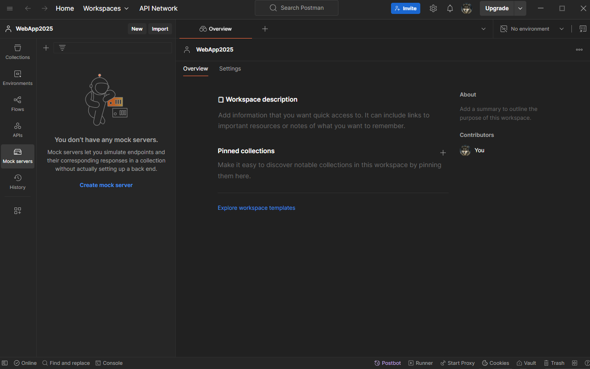

React is a JavaScript library for rendering user interfaces. React is written in JSX which is a mix of HTML and JavaScript. React components are JavaScript functions. React components always begin with a capital letter. HTML tags always begin with lowercase.

The first thing is looking for the "return" which is the code block that return what the JavaScript makes and within the return we will write the whole script in html and CSS.

In the React components, the **export default** keywords specify the main component in the file. For displaying data within the **export default** module, variable must be embedded within curly braces. React components are enclosed between a shared parent like or an empty \<\>...\</\> wrapper. In React, you specify a CSS class with **className**. It works the same way as the HTML **class** attribute. To add CSS files, the simplest way is to add a <link> tag to the HTML.

**const** is a keyword in JavaScript that is used to declare a variable whose value cannot be changed (or reassigned) after it is defined. In JavaScript, **let** is a keyword used to declare variables that are block-scoped and can be re-assigned. Variables declared with **let** are only accessible within the block they are defined in. In JavaScript, **console.log()** is a built-in function used to print messages or output values to the console.

Hooks are the tool to connect the business logic (JavaScript) with the graphic bit (HTML y CSS) of the app.

Vite is the tool to build up the skeleton of the web apps https://start.spring.io/.

Postman Mock server publica los datos y genera un endpoit

It is important to install npm within the pronunciationAppFront (or any app). The **npm -v** command shows the npm version installed in the app and also check if the npm package is installed. The **npm -i** is used to install the app npm. Later on, run the command npm **run dev** to execute the app [[REACT starting a new project from scracth]].

