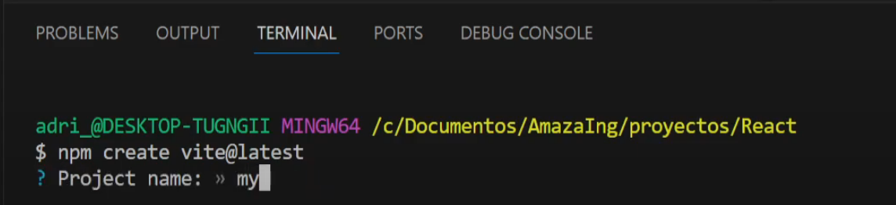
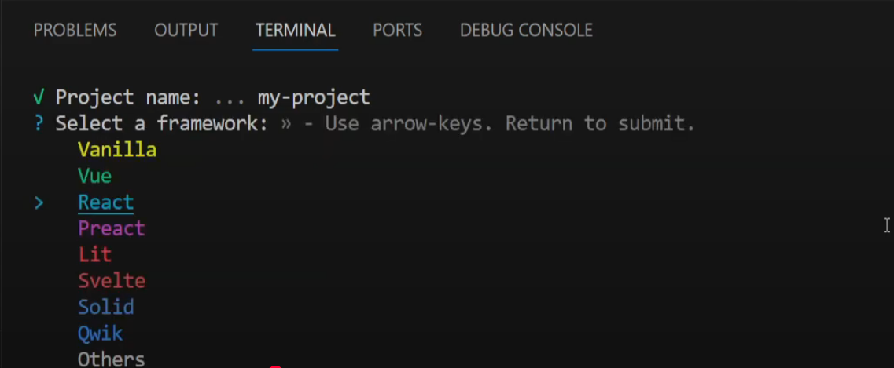
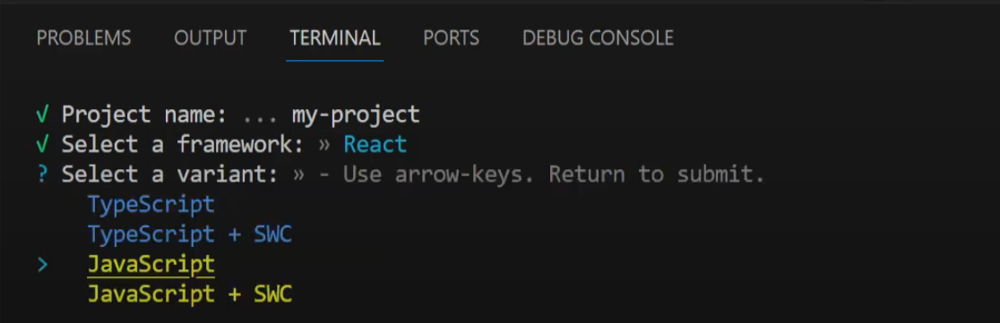
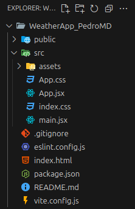
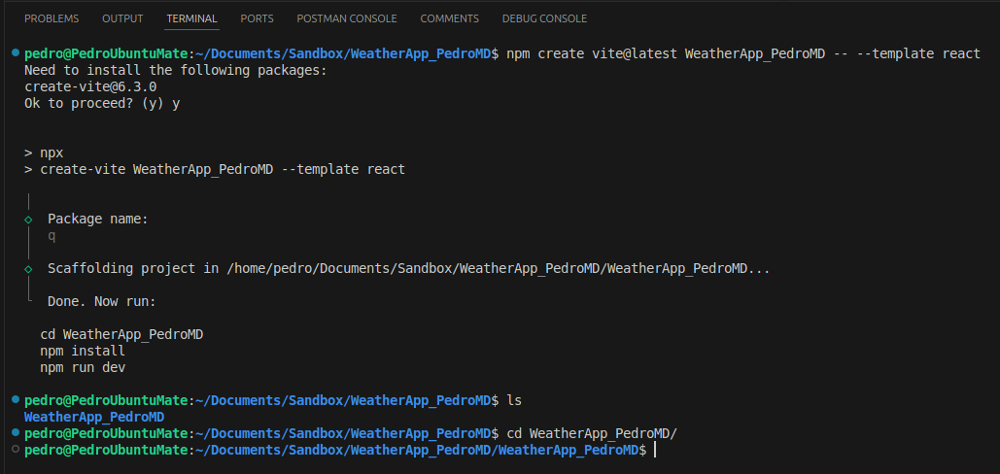
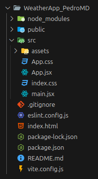
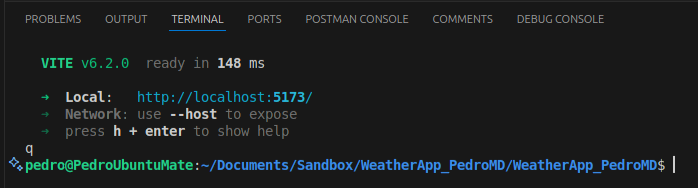
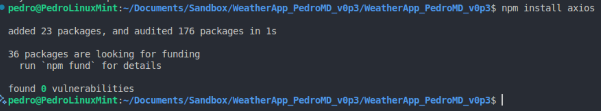
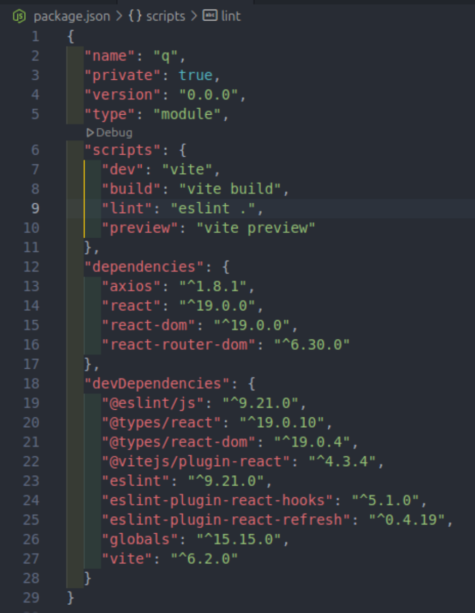

# Starting a REACT project from scratch

### Shortest way

The shortcut to do a react project faster is to create an open folder and open it with Visual Studio Code. Inside this folder, open the VSC terminal and run the following code:

```javaScript
npm create vite@latest
```


After running that command, the VSC terminal will ask for the name of the project as shown in the image above. Next, as shown below, VSC terminal asks for selecting which framework to use. In this case, is React.


Finally, it must be selected the code language:

### Another way
The first thing is to go to <https://vite.dev/guide/> to create a react project with Vite using a template. The code to generate the react template is:

```java
npm create vite@latest my-vue-app -- --template react
```

Create a folder where the project will be hosted. Next, open that folder with Visual Studio Code. In the VSC terminal, paste the above command and run it to create the react project scaffolding. This command should be copied and the words _my-vue-app_ changed with the name of the project to work on. Before running this command, the package **create-vite@6.3.0** should be installed. If not, the terminal will ask you to install itself for you.

Afterwards, the react skeleton will be shown in the VSC explorer as shown below:


### After one of these two beginnings, common steps to install dependencies

Next, npm should be installed **but** within the project folder, so that it will be need to go with the terminal one more folder below (<span style="background:#ff4d4f">within the project folder!!</span>) as shown in the picture below:


After the npm installation, the folder structure has changed with two new files: node-modules and package-lock.json whih have been created by npm.


Finally, run the command npm run dev to check that the installation of the react app has been correct.


By clicking in the link of the localhost:5173 the browser will show the icons of react and vite indicating that the installation process has been cone correctly.

Next, install the react-router-dom [[REACT Render Virtual DOM]] with the command `npm install react-router-dom` [[REACT React-Router-DOM]] with the project folder as we are going to implement several tabs in a single page application (SPA).

Finally, axios should be installed as well. Then, run the command *npm install axios*.


At the end, looking at on the file *package.json* all the dependencies installed in the project.

