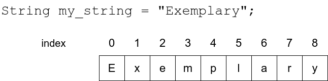
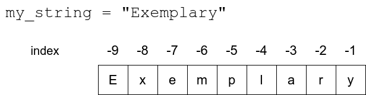
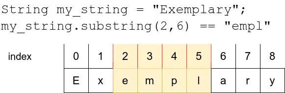

 [Python tutor](https://pythontutor.com/)
 A code which asks the user to type in a limit. The program then calculates the sum of consecutive numbers (1 + 2 + 3 + ...) until the sum is at least equal to the limit set by the user.  In addition to the result it should also print out the calculation performed:

```python
limit = int(input("Limit:"))
num = 1
i = 1
x = "1"
while i < limit:
    num += 1
    i += num
    x += f" + {num}"
print(f"The consecutive sum: {x} = {i}")
```
`Output: Limit:`<font color="#ff0000"> **18**</font> `The consecutive sum: 1 + 2 + 3 + 4 + 5 + 6 = 21`

Using string operations together with a loop we can write a program which draws a pyramid:

```python
n = 10 # number of layers in the pyramid
row = "*"

while n > 0:
    print(" " * n + row)
    row += "**"
    n -= 1
```
This prints out the following:

```x
          *
         ***
        *****
       *******
      *********
     ***********
    *************
   ***************
  *****************
 *******************
```

The following program loops through all the characters in a string from first to last:
```python
input_string = input("Please type in a string: ")
index = 0
while index < len(input_string):
    print(input_string[index])
    index += 1
```
Since the first character in a string has the index 0, the last character has the index _length - 1_.


You can also use negative indexing to access characters counting from the end of the string. The last character in a string is at index -1, the second to last character is at index -2, and so forth.


If you know the beginning and end indexes of the slice you wish to extract, you can do so with the notation `[a:b]`. This means the slice begins at the index `a` and ends at the last character before index `b` - that is, including the first, but excluding the last.


