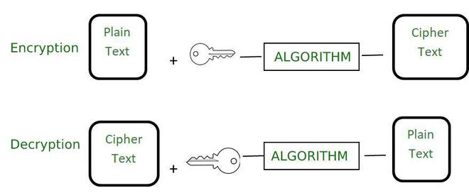
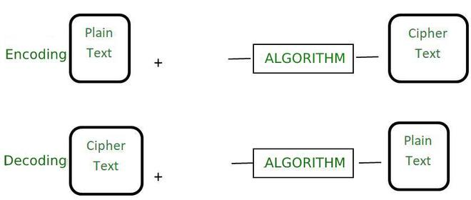

Encryption and Encoding are terms often interchanged and used incorrectly, but they have distinct differences. Anyone dealing with communication networks or data security needs to be aware of these distinctions. In this article, we will learn the difference between the two terms, encryption and encoding.
## What is Encryption?

It is a process used to convert simple readable data known as plain text to unreadable data known as ciphertext which can only be converted to plain text if the user knows the encryption key. It is used basically to keep our data safe. The main purpose of encryption is to convert our data in such a form that it is garbage for the person who does not know the encryption key. It is used to prevent unauthorized access. The reverse of encryption is decryption and it is used to get back the plain text from the ciphertext. For decryption, we must know the encryption key and the encryption algorithm.

The encrypted data is just treated like other data. We can also use more than one encryption algorithm on the same data. The real-life examples are sending someone a secret message that only they should be able to read, or securely sending a password over the Internet. The goal is data confidentiality.

**Examples of Encryption Algorithms:** are [AES](https://www.geeksforgeeks.org/advanced-encryption-standard-aes/), [RSA](https://www.geeksforgeeks.org/rsa-algorithm-cryptography/), and [Blowfish](https://www.geeksforgeeks.org/blowfish-algorithm-with-examples/).

## What is Encoding?

It is the process to transform data in such a format that it can be easily used by different types of systems. The algorithm used to encode the data is publicly available and it can be easily decoded in the readable form if the person knows the algorithm. It does not require any key to decode the information. The main purpose is data usability instead of confidentiality. The main aim of encoding is to transform the data so that it can be properly used by a different type of system. It is not used to protect the data as it is easy to reverse in comparison to encryption.

This process is used to ensure the integrity and usability of data. The real-life examples are like binary data being sent over email or viewing special characters on a web page. The main goal is data usability.

**Examples of Encoding Algorithm**: [ASCII](https://www.geeksforgeeks.org/ascii-table/), [UNICODE](https://www.geeksforgeeks.org/ascii-vs-unicode/), [URL Encoding](https://www.geeksforgeeks.org/html-url-encoding/), Base64

## Difference Between Encryption and Encoding

| **Basis**                    | **Encryption**                                                                                                                                                                         | **Encoding**                                                                                                                                |
| ---------------------------- | -------------------------------------------------------------------------------------------------------------------------------------------------------------------------------------- | ------------------------------------------------------------------------------------------------------------------------------------------- |
| **Definition**           | It is the process to encode data securely such that only the authorized user who knows the key or password is able to retrieve the original data for everyone else it is just garbage. | It is the process of transforming data into such a format that it can be by a different type of system using publicly available algorithms. |
| **Purpose**              | The purpose of encryption is to transform data to keep it secret from others.                                                                                                          | The main purpose is the protection of the integrity of data.                                                                                |
| **Used for**             | It is used to maintain data confidentiality.                                                                                                                                           | It is used to maintain data usability.                                                                                                      |
| **Reverse Process**      | The original data can be retrieved using decryption.                                                                                                                                   | The original data can be retrieved using decoding. The algorithm used to encode the data is publicly available.                             |
| **Key requirement**      | The encryption key is required to decrypt the data and get the original data.                                                                                                          | The encryption key is not required to decrypt the data and get the original data.                                                           |
| **Secure**               | The encrypted data is more secure.                                                                                                                                                     | The encoded data is less secure. It can easily be decoded.                                                                                  |
| **Example of Algorithm** | AES, RSA, and Blowfish.                                                                                                                                                                | ASCII, UNICODE, URL encoding, Base64.                                                                                                       |
| **Real-life example**    | Securely sending a password over the internet.                                                                                                                                         | viewing special characters on the web page.                                                                                                 |
## Conclusion

While both [encryption](https://www.geeksforgeeks.org/what-is-data-encryption/) and [encoding](https://www.geeksforgeeks.org/encryption-encoding-hashing/) transform data, they serve different purposes. Whereas encoding is concerned with data usability—making sure that data can be appropriately understood by a variety of systems—encryption is concentrated on data secrecy—making sure that only authorized users can access the information. Comprehending these distinctions is vital for proficiently handling and safeguarding information.