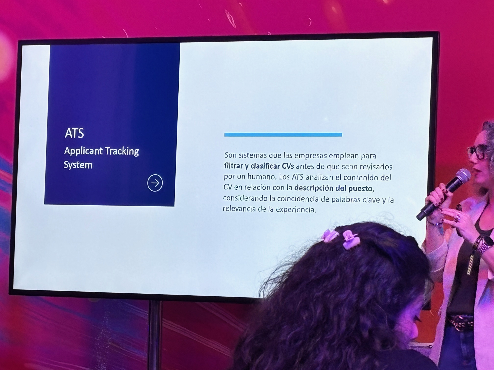
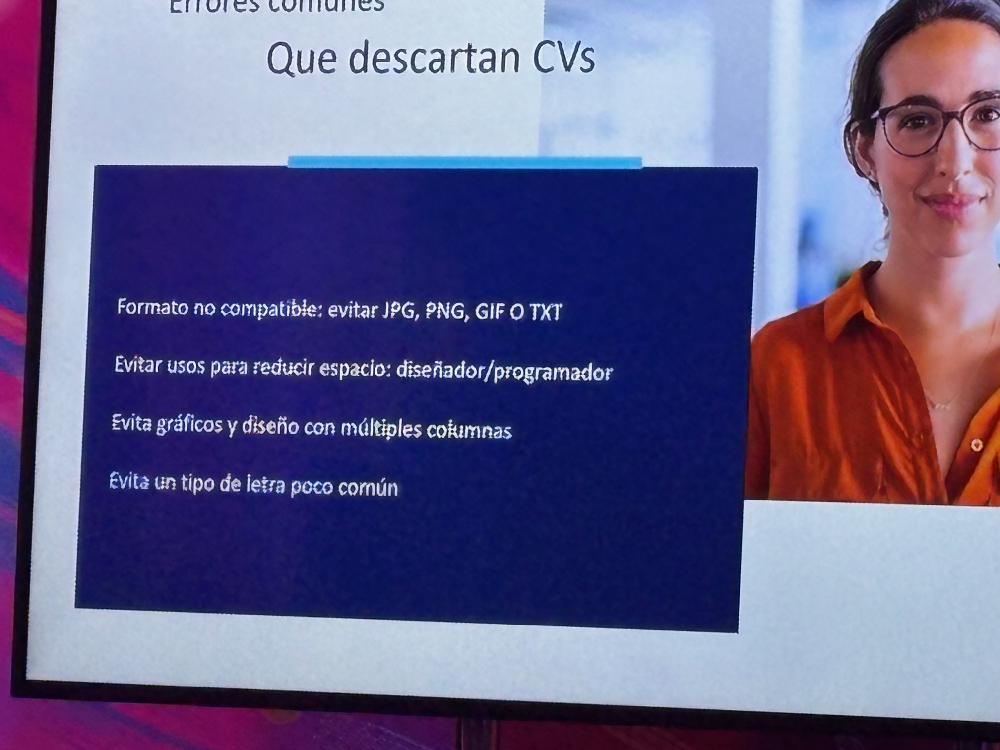
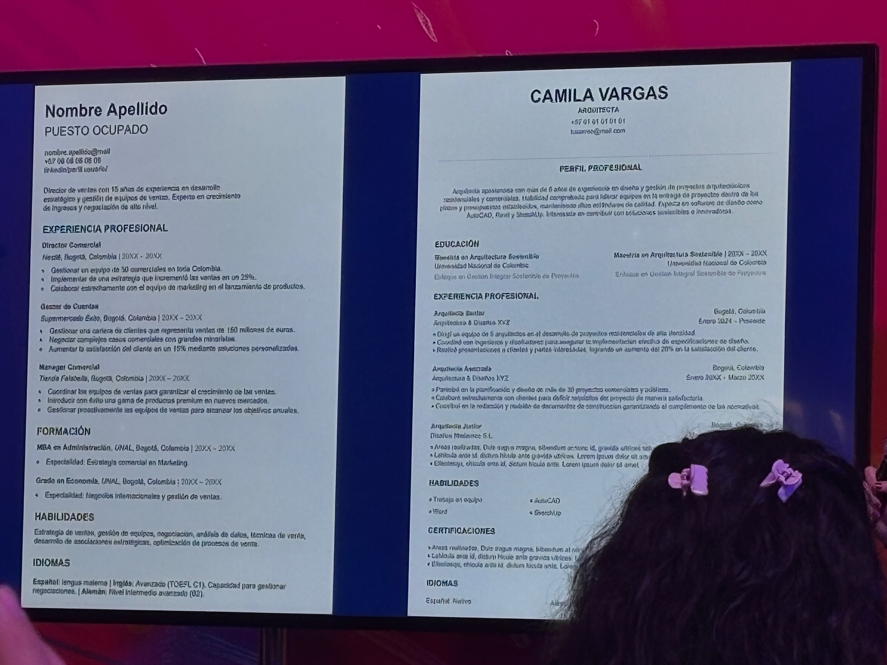
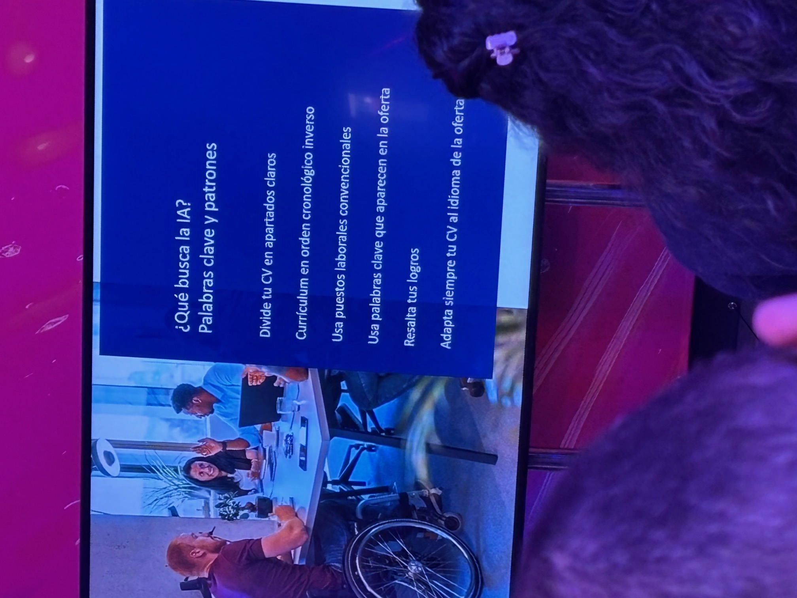
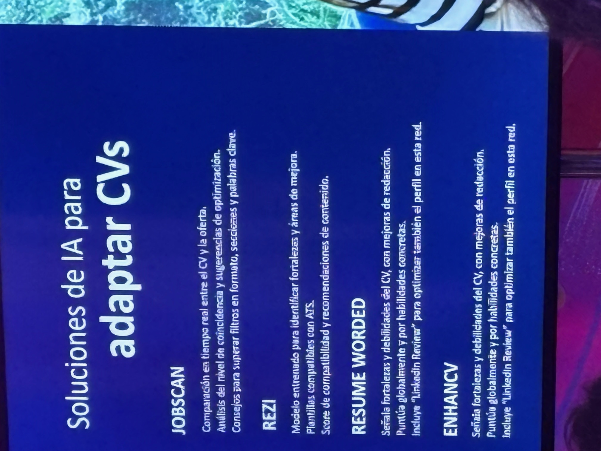
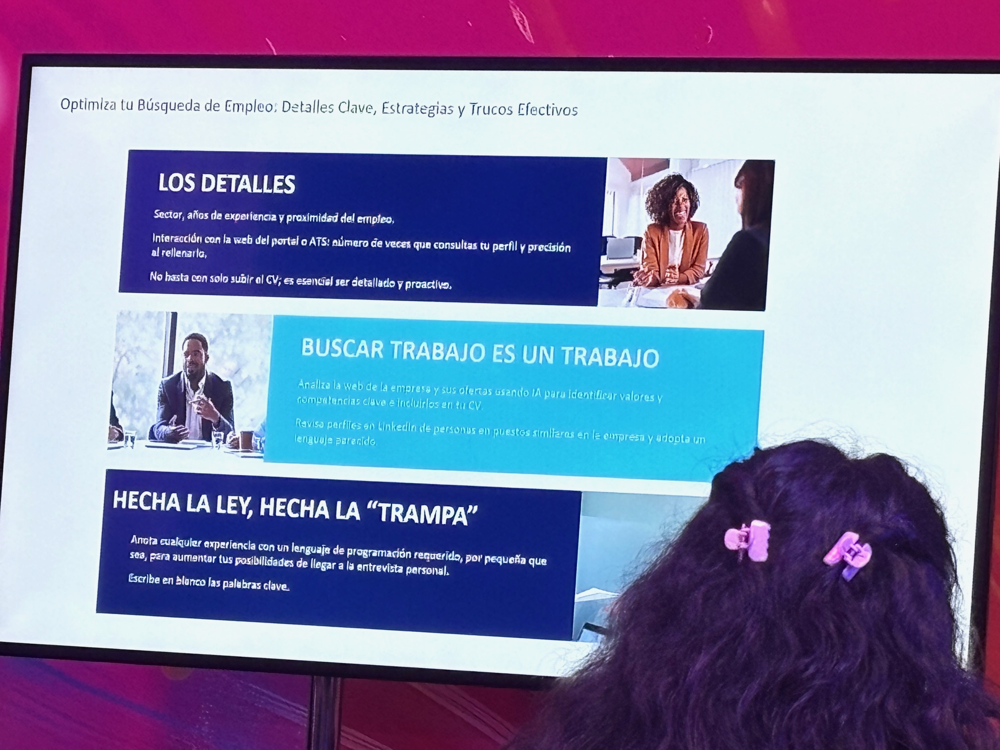

## RESUMEN y SLIDES de la charla de como hackear a los Applicant Tracking Systems

## HACK YOUR CV: HOW TO OVERCOME AI FILTERS IN YOUR JOB SEARCH TECH (FUNDATION)

Las applicant tracker systems son programas que escanean los CV y buscando palabras claves del interes del contratador, asi como otros filtros, en cuestion de minutos estos softwares seleccionan cientos de CV en pdfs.

[Applicant Tracker Google Serach](https://www.google.com/search?q=applicant+trackers+system&oq=applicant+trackers&gs_lcrp=EgZjaHJvbWUqBwgBECEYnwUyBggAEEUYOTIHCAEQIRifBTIHCAIQIRifBTIHCAMQIRifBTIHCAQQIRifBTIHCAUQIRifBTIHCAYQIRifBTIHCAcQIRifBTIHCAgQIRifBTIHCAkQIRifBdIBCDU4NjRqMGo0qAIAsAIB&sourceid=chrome&ie=UTF-8)

Por que se descartan los CVs:

Es importante evitar el tema de puestos de trabajo con nombres compuestos o cosas como: programador/desarrolador o cosas asi, ya que el ATS no leera nada,

> [!MUY IMPORANTE]
  Las fechas tienen que estar con mes y año (Julio 2010) sin poner en medio simbolos como: **-** ,  **/**.  Sino los ATS no podran cuantificar bien los meses de experiencia laboral.

Ejemplos de CV que pasarian el filtro de los ATS:

Estos CV estan sin colorines, columnas, tipo de letra comun y en formato pdf. Importante que el CV este dividido en apartados como **experiencia profesional**, **formacion**, etc con sus cabeceras bien claras explicando cada apartado.

Que busca la IA:

Unos links para adaptar los CV para los ATS:
- <https://www.jobscan.co/>
- <https://www.rezi.ai/>
- <https://www.rezi.ai/>
- <https://enhancv.com/>  (este ultimo para mas bonito a quien lo necesite por temas especificos, pero no aconsejable para los ATS el incluir graficos, etc.).

La ultima slide con un consejo **MUY IMPORTANTE**:

> [!IMPORTANTE]
  Al final del CV, en el pie de pagina, volver a escribir las palabras clave en **BLANCO** y **fuente pequeña (max 10 pts)** por si el ATS no ha detectado bien las palabras clave durante el escaneo del CV, al final del todo escaneara todas. El color blanco es para que esta pequeña trampa no se vea en caso de que impriman el CV.

Otros 2 links para ampliar informacion:

<https://growthhackyourcareer.com/how-to-beat-the-ats/>
