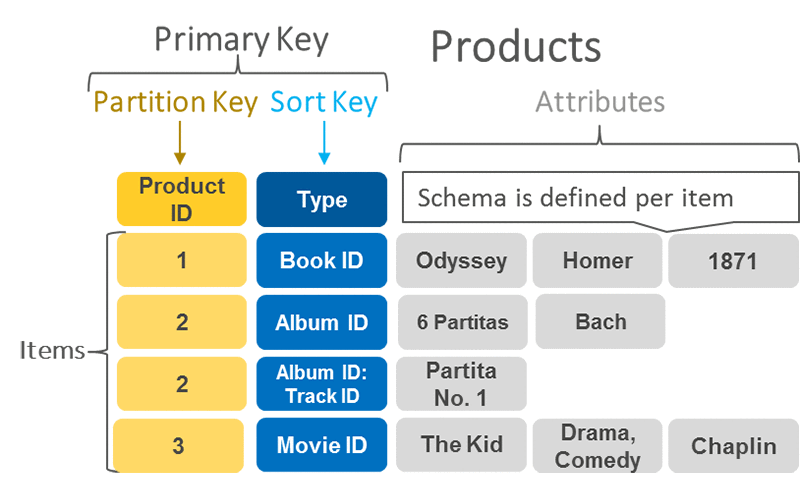

### Steps before picking code
It is paramount to know the **client's needs**. It is important to talk and discuss with the client as much as possible to know what necessities wants to cover or fix. A **common vocabulary** between the client and the developer must be set up to ease communication. By means of using the same vocabulary, will be possible to find out client's needs, in other words what the client wants to resolve. These discussions with a common vocabulary and the identification of those needs to be resolved reduce the uncertainties of the project. The developer needs to know the **business model** of the client to know client's needs.

- Tech stack: code languages, software list to be used in the project and IDE's (development, testing  and production environment (Modulith)
- Documentation
- Business model (features: car availability, booking, user payment, car tracking)
- Project structure (skeleton)
- Intro Hilla
- Architecture Hilla
- Data structure (with excel)
- Core objetives (domains)
- Create a mock of the Front
- Define the basic features

Data definitions and structure drives the frontend, the react hooks, the axios, etc.

### Options
Spring Vaadin Flow (All Java)
Spring Vaadin Hilla (React) with tsx (Albert)
React and data from hardcoded for local storage
React + backend with Next.js
Full Next.js

[Vaadin offical docs](https://vaadin.com/docs/latest/)
[Starting an App with Vaadin](https://start.vaadin.com/app)
[Albert notes Vaadin-Flow](https://albertprofe.dev/springboot/boot-concepts-vaadin-flow.html)
[Albert notes about Vaadin-Hilla](https://albertprofe.dev/springboot/boot-concepts-vaadin-hilla.html)

React and Spring Boot are connected by WebSockets by the atmosphere technology (Framework).

---
### Database selection
[SWOT between NoSQL and SQL](../../Class%20Notes/Databases/SWOT%20between%20NoSQL%20and%20SQL.md)

[AWS docs](https://aws.amazon.com/blogs/database/choosing-the-right-dynamodb-partition-key/)

