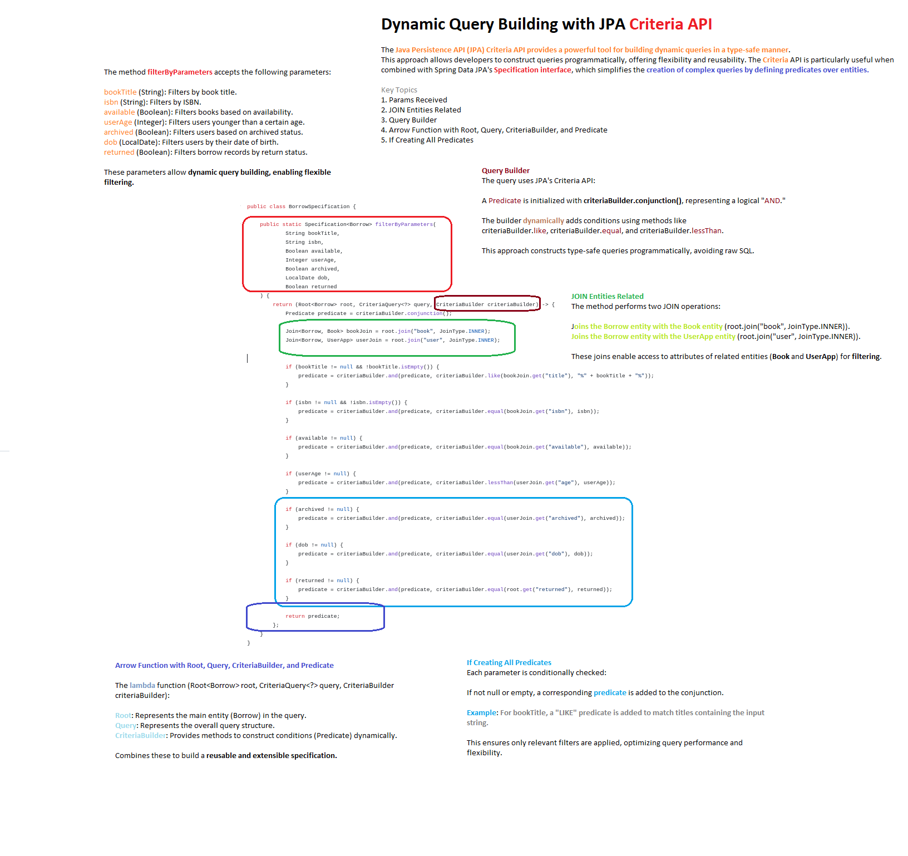

[Offical docs](https://docs.spring.io/spring-data/jpa/reference/jpa/specifications.html)
Criteria API are the tool to connect the database and its tables of the project with the queries needed for the business logic. Important points are:
- Parameters
- Root
- Query
- Criteria builder
- Join entities
- Arrow function with Root, Query, CriteriaBuilder, and Predicate
- Ifs creating all predicates

> The `Predicate` container is a critical part of the JPA Criteria API because it enables **dynamic**, **type-safe**, and **composable** query construction. 

In our `BorrowSpecification` class, it serves as the glue that combines multiple filtering conditions into a single, cohesive `WHERE` clause. 

Its relevance lies in its f<mark>lexibility and power</mark>, making it an essential tool for building modern, maintainable, and efficient database queries in Java applications, especially when paired with Spring Data JPA.

Code example for a predicate:

```java
import org.springframework.data.jpa.domain.Specification;
import javax.persistence.criteria.*;
import java.time.LocalDate;

public class BorrowSpecification {

    public static Specification<Borrow> filterByParameters(
            String bookTitle,
            String isbn,
            Boolean isAvailable,
            Integer userAge,
            Boolean isArchived,
            LocalDate dob,
            Boolean isReturned
    ) {
        return (Root<Borrow> root, CriteriaQuery<?> query, CriteriaBuilder criteriaBuilder) -> {
            Predicate predicate = criteriaBuilder.conjunction();

            // Join with related entities
            Join<Borrow, Book> bookJoin = root.join("book", JoinType.INNER);
            Join<Borrow, UserApp> userJoin = root.join("user", JoinType.INNER);

            // Filter by book title (LIKE)
            if (bookTitle != null && !bookTitle.isEmpty()) {
                predicate = criteriaBuilder.and(predicate, criteriaBuilder.like(bookJoin.get("title"), "%" + bookTitle + "%"));
            }

            // Filter by ISBN
            if (isbn != null && !isbn.isEmpty()) {
                predicate = criteriaBuilder.and(predicate, criteriaBuilder.equal(bookJoin.get("isbn"), isbn));
            }

            // Filter by book availability
            if (isAvailable != null) {
                predicate = criteriaBuilder.and(predicate, criteriaBuilder.equal(bookJoin.get("isAvailable"), isAvailable));
            }

            // Filter by user age
            if (userAge != null) {
                predicate = criteriaBuilder.and(predicate, criteriaBuilder.lessThan(userJoin.get("age"), userAge));
            }

            // Filter by user archived status
            if (isArchived != null) {
                predicate = criteriaBuilder.and(predicate, criteriaBuilder.equal(userJoin.get("isArchived"), isArchived));
            }

            // Filter by user date of birth
            if (dob != null) {
                predicate = criteriaBuilder.and(predicate, criteriaBuilder.equal(userJoin.get("dob"), dob));
            }

            // Filter by borrow return status
            if (isReturned != null) {
                predicate = criteriaBuilder.and(predicate, criteriaBuilder.equal(root.get("isReturned"), isReturned));
            }

            return predicate;
        };
    }
}
```

> In the context of `BorrowSpecification` class, a **Predicate** is a core concept from the Java Persistence API (JPA) Criteria API, used to build dynamic and type-safe database queries.
> 
> It represents a condition or a set of conditions that can be applied to filter data in a query.
> 
> The `Predicate` object acts as a **container** for these conditions, allowing  to combine and manipulate them (e.g., with logical operators like `AND`, `OR`, `NOT`) to create complex query filters.

In our code, the `Predicate` object (`predicate`) is used within a `Specification` to dynamically construct a `WHERE` clause for a database query based on the provided parameters (`bookTitle`, `isbn`, `available`, etc.).

### What is a Predicate?

A `Predicate` is an object provided by the JPA Criteria API (`javax.persistence.criteria.Predicate`) that represents a single condition or a combination of conditions in a query. For example:

- `bookJoin.get("title").like("%" + bookTitle + "%")` creates a condition checking if the book title contains a specific substring.
- `criteriaBuilder.equal(bookJoin.get("isbn"), isbn)` creates a condition checking if the ISBN matches a given value.

The `Predicate` acts as a **container** because it can hold one or more of these conditions and allows them to be combined using logical operators (e.g., `AND`, `OR`) via the `CriteriaBuilder`.

In your code:

```java
Predicate predicate = criteriaBuilder.conjunction();
```

- `criteriaBuilder.conjunction()` **initializes an empty `Predicate` that represents a logical `AND` operation**. It starts as a "true" condition (i.e., no filtering yet) and serves as the foundation to which additional conditions are added.
### How Does it Work in Your Code?

Your `filterByParameters` method builds a dynamic query by incrementally adding conditions to the `Predicate` based on the input parameters. Here’s how it works:

1. **Initialization**:
   
   ```java
   Predicate predicate = criteriaBuilder.conjunction();
   ```
   
   - The `predicate` starts as an empty container (effectively a "true" condition).

2. **Joining Tables**:
   
   ```java
   Join<Borrow, Book> bookJoin = root.join("book", JoinType.INNER);
   Join<Borrow, UserApp> userJoin = root.join("user", JoinType.INNER);
   ```
   
   - These joins allow the query to access fields from the related `Book` and `UserApp` entities in the `Borrow` table.

3. **Adding Conditions**:
   
   - Each `if` block checks whether a parameter is provided (e.g., `bookTitle != null && !bookTitle.isEmpty()`).
   - If a parameter is present, a condition is created using the `CriteriaBuilder` (e.g., `criteriaBuilder.like`, `criteriaBuilder.equal`, etc.).
   - The condition is combined with the existing `predicate` using `criteriaBuilder.and`:
     
     ```java
     predicate = criteriaBuilder.and(predicate, criteriaBuilder.like(bookJoin.get("title"), "%" + bookTitle + "%"));
     ```
   
   - This effectively "appends" the new condition to the `predicate` container, combining it with the previous conditions using an `AND` operator.

4. **Returning the Predicate**:
   
   ```java
   return predicate;
   ```
   
   - Once all conditions are added, the `predicate` is returned as part of the `Specification`. JPA uses this to construct the final SQL `WHERE` clause.

For example, if `bookTitle = "Java"` and `available = true` are provided, the resulting `Predicate` might represent:

```
WHERE book.title LIKE '%Java%' AND book.available = true
```

### Why is the Predicate Container Relevant and Useful?

The `Predicate` object is a powerful and flexible tool in JPA for several reasons:
#### 1. **Dynamic Query Building**

- Without `Predicate`, we’d need to write static SQL or JPQL queries with fixed conditions, which wouldn’t adapt to varying input parameters. With `Predicate`, we can dynamically include only the conditions that are relevant based on the provided parameters.
- Example: If `userAge` is `null`, no age-related condition is added to the query. This avoids unnecessary complexity and ensures the query remains efficient.
#### 2. **Type Safety**

- The Criteria API (and thus `Predicate`) is type-safe, meaning conditions are built using Java objects and methods (e.g., `bookJoin.get("title")`) rather than raw strings. This reduces runtime errors (e.g., typos in column names) and allows IDEs to provide autocompletion and validation.
#### 3. **Composability**

- The `Predicate` container allows you to combine multiple conditions using logical operators (`AND`, `OR`, `NOT`). For example:
  
  ```java
  predicate = criteriaBuilder.and(predicate, condition1);
  predicate = criteriaBuilder.or(predicate, condition2);
  ```

- This makes it easy to create complex filters, such as `(title LIKE '%Java%' AND available = true) OR (isbn = '12345')`.
#### 4. **Reusability**

- The `Specification` pattern (which uses `Predicate`) promotes reusable query logic. We can define multiple `Specification` classes or methods (like `filterByParameters`) and combine them as needed in your repository layer.
#### 5. **Maintainability**

- By centralizing query logic in a `Specification` class, our code becomes more modular and easier to maintain. If we need to change how a filter works (e.g., modify the `userAge` condition), we update it in one place rather than across multiple queries.
#### 6. **Integration with Spring Data JPA**

- Spring Data JPA’s `Specification` interface leverages `Predicate` to integrate seamlessly with repository methods. We can pass a `Specification` to a repository method (e.g., `findAll(Specification<Borrow> spec)`) to execute the dynamic query.
### Example of Usefulness

Imagine a scenario where a user wants to search for borrowed books with these filters:

- Book title contains "Spring"
- Book is available
- User is younger than 30

Without `Predicate`, we might write a JPQL query like this:

```java
@Query("SELECT b FROM Borrow b WHERE b.book.title LIKE :title AND b.book.available = :available AND b.user.age < :age")
List<Borrow> findBorrows(String title, Boolean available, Integer age);
```

But what if some parameters are optional? We’d need multiple query variations or complex conditional logic in the query string, which becomes unmanageable.

With your `BorrowSpecification`, the same query is built dynamically:

```java
Specification<Borrow> spec = BorrowSpecification.filterByParameters("Spring", null, true, 30, null, null, null);
List<Borrow> results = borrowRepository.findAll(spec);
```

The `Predicate` ensures only the provided parameters (`bookTitle`, `available`, `userAge`) are included in the query, resulting in:

```
WHERE book.title LIKE '%Spring%' AND book.available = true AND user.age < 30
```
