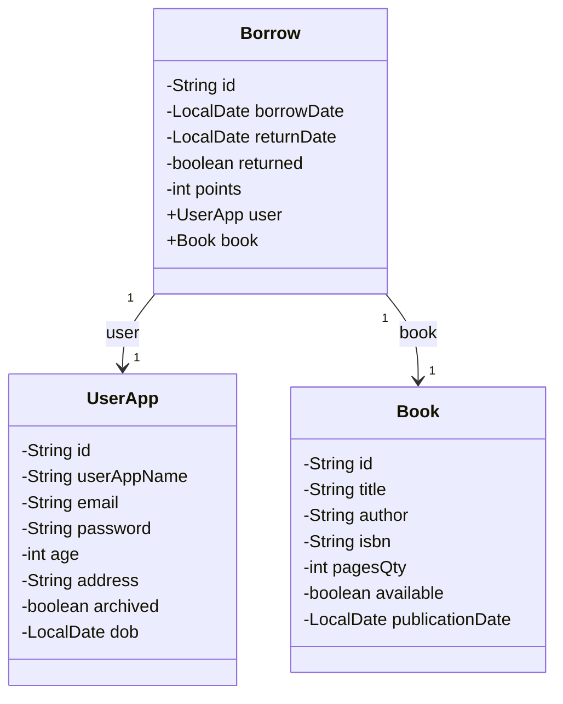

# userBorrowBook back

## Links & Intro

A Spring Boot project with H2 local database and JPA for a <mark>borrowing system</mark> typically includes:

1. Entity classes (`Book`, `User`, <mark>Borrow</mark>) annotated with `@Entity`

2. **Repository** interfaces extending `JpaRepository` for CRUD operations

3. Service layer for business logic

4. REST controllers annotated with <mark>@RestController for API endpoints</mark>

5. <mark>application.properties</mark> file configuring H2 database and JPA

6. `pom.xml `with dependencies for Spring Boot, Spring Data JPA, and H2

> The `Borrow` entity would have relationships with `Book` and `User` entities. Controllers would expose endpoints for creating, reading, updating, and deleting borrow records. 

> The H2 database provides an in-memory database for development and testing purposes, while JPA simplifies database operations and object-relational mapping.

## Model



## API Rest Controller

### Book

REST controller for the Book entity using ResponseEntity and autowired to the BookRepository:

```java
package com.example.userBorrowBook.controller;

import com.example.userBorrowBook.model.Book;
import com.example.userBorrowBook.repository.BookRepository;
import org.springframework.beans.factory.annotation.Autowired;
import org.springframework.http.HttpStatus;
import org.springframework.http.ResponseEntity;
import org.springframework.web.bind.annotation.*;

import java.util.List;
import java.util.Optional;

@RestController
@RequestMapping("/api/books")
public class BookController {

    @Autowired
    private BookRepository bookRepository;

    @GetMapping
    public ResponseEntity<List<Book>> getAllBooks() {
        List<Book> books = bookRepository.findAll();
        return new ResponseEntity<>(books, HttpStatus.OK);
    }

    @GetMapping("/{id}")
    public ResponseEntity<Book> getBookById(@PathVariable String id) {
        Optional<Book> book = bookRepository.findById(id);
        return book.map(value -> new ResponseEntity<>(value, HttpStatus.OK))
                .orElseGet(() -> new ResponseEntity<>(HttpStatus.NOT_FOUND));
    }

    @PostMapping
    public ResponseEntity<Book> createBook(@RequestBody Book book) {
        Book savedBook = bookRepository.save(book);
        return new ResponseEntity<>(savedBook, HttpStatus.CREATED);
    }

    @PutMapping("/{id}")
    public ResponseEntity<Book> updateBook(@PathVariable String id, @RequestBody Book bookDetails) {
        Optional<Book> optionalBook = bookRepository.findById(id);
        if (optionalBook.isPresent()) {
            Book book = optionalBook.get();
            book.setTitle(bookDetails.getTitle());
            book.setAuthor(bookDetails.getAuthor());
            book.setIsbn(bookDetails.getIsbn());
            book.setPagesQty(bookDetails.getPagesQty());
            book.setAvailable(bookDetails.isAvailable());
            book.setPublicationDate(bookDetails.getPublicationDate());
            Book updatedBook = bookRepository.save(book);
            return new ResponseEntity<>(updatedBook, HttpStatus.OK);
        } else {
            return new ResponseEntity<>(HttpStatus.NOT_FOUND);
        }
    }

    @DeleteMapping("/{id}")
    public ResponseEntity<HttpStatus> deleteBook(@PathVariable String id) {
        try {
            bookRepository.deleteById(id);
            return new ResponseEntity<>(HttpStatus.NO_CONTENT);
        } catch (Exception e) {
            return new ResponseEntity<>(HttpStatus.INTERNAL_SERVER_ERROR);
        }
    }

    @GetMapping("/author/{author}")
    public ResponseEntity<List<Book>> getBooksByAuthor(@PathVariable String author) {
        List<Book> books = bookRepository.findByAuthor(author);
        return new ResponseEntity<>(books, HttpStatus.OK);
    }

    @GetMapping("/title/{keyword}")
    public ResponseEntity<List<Book>> getBooksByTitleKeyword(@PathVariable String keyword) {
        List<Book> books = bookRepository.findByTitleContaining(keyword);
        return new ResponseEntity<>(books, HttpStatus.OK);
    }

    @GetMapping("/isbn/{isbn}")
    public ResponseEntity<Book> getBookByIsbn(@PathVariable String isbn) {
        Book book = bookRepository.findByIsbn(isbn);
        return book != null ? new ResponseEntity<>(book, HttpStatus.OK) : new ResponseEntity<>(HttpStatus.NOT_FOUND);
    }
}
```

This BookController provides the following endpoints:

1. GET /api/books - Get all books
2. GET /api/books/{id} - Get a book by ID
3. POST /api/books - Create a new book
4. PUT /api/books/{id} - Update an existing book
5. DELETE /api/books/{id} - Delete a book
6. GET /api/books/author/{author} - Get books by author
7. GET /api/books/title/{keyword} - Get books by title keyword
8. GET /api/books/isbn/{isbn} - Get a book by ISBN

The controller uses ResponseEntity to handle HTTP responses and status codes. It also autowires the BookRepository to interact with the database.

### Borrow

The `BorrowController` manages book borrowing operations. It exposes REST API endpoints under `/api/v1/borrows`. 

It uses `BorrowRepository` to interact with the database. The controller supports:

- **Filtering Borrows:** Retrieves borrows based on book title, ISBN, availability, user age, archive status, date of birth, and returned status.

- **Getting Borrow by ID:** Fetches a specific borrow record using its ID.

- **Creating Borrow:** Creates a new borrow record.

- **Updating Borrow:** Modifies an existing borrow record using its ID.

- **Deleting Borrow:** Deletes a borrow record using its ID.

- **Getting Borrows by User ID:** Retrieves all borrows associated with a specific user.

- **Getting Borrows by Book ID:** Retrieves all borrows associated with a specific book.

It uses `ResponseEntity` to return appropriate HTTP statuses and data. It also enables <mark>Cross-Origin Resource Sharing (CORS) from any origin</mark>.

## API Rest

Borrow:

```json
[
  {
    "id": "BR001",
    "borrowDate": "2025-02-15",
    "returnDate": "2025-03-15",
    "returned": true,
    "points": 10,
    "user": {
      "id": "U001",
      "userAppName": "John Doe",
      "email": "john.doe@example.com",
      "password": "password123",
      "age": 30,
      "address": "123 Main St, Anytown, USA",
      "archived": false,
      "dob": "1995-05-15"
    },
    "book": {
      "id": "B001",
      "title": "To Kill a Mockingbird",
      "author": "Harper Lee",
      "isbn": "9780446310101",
      "pagesQty": 281,
      "available": true,
      "publicationDate": "1960-07-11"
    }
  },
  {
    "id": "BR002",
    "borrowDate": "2025-02-16",
    "returnDate": "2025-03-16",
    "returned": false,
    "points": 5,
    "user": {
      "id": "U002",
      "userAppName": null,
      "email": "jane.smith@example.com",
      "password": "securepass456",
      "age": 29,
      "address": "456 Elm St, Somewhere, USA",
      "archived": false,
      "dob": "1997-08-22"
    },
    "book": {
      "id": "B002",
      "title": "1984",
      "author": "George Orwell",
      "isbn": "9780451524935",
      "pagesQty": 328,
      "available": true,
      "publicationDate": "1949-06-08"
    }
  }
]
```
